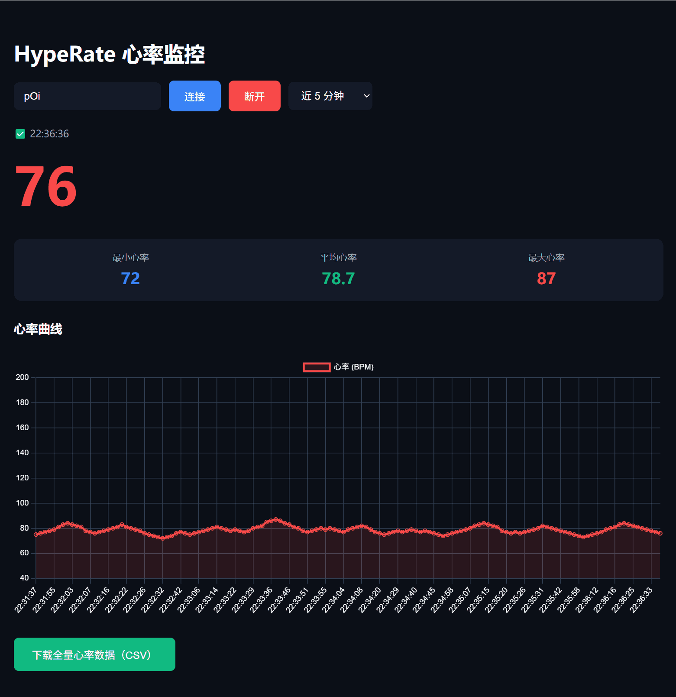

HypeRate 心率监控页面

用于监控安卓app`HypeRate`广播的心率数据，支持WebSocket自动重连、多时间范围数据筛选、心率统计及数据导出功能。

github pages: https://dyxcloud.github.io/hyperate-log-csv/

✨ 核心功能

- 📊 实时心率展示：直观显示当前心率数值，同步更新状态

- 📈 多范围心率曲线：支持切换「近1分钟/5分钟/10分钟/30分钟/全部数据」，曲线实时刷新

- 📋 心率统计：同步显示当前所选时间范围内的最小心率、平均心率、最大心率

- 🔄 自动重连：WebSocket连接断开后自动重试，保障数据不中断

- 💾 数据导出：支持将全量心率数据导出为CSV文件，便于后续分析

🚀 使用步骤

1. 打开页面，输入HypeRate设备ID（默认已填充示例ID：pOi）

2. 点击「连接」按钮，页面将自动建立WebSocket连接并订阅心率数据

3. 连接成功后，可在页面中查看：

- 实时心率数值（红色粗体显示）

- 当前时间范围的心率统计（最小/平均/最大）

- 心率变化曲线（可通过下拉框切换时间范围）

4. 点击「下载全量心率数据（CSV）」，可导出所有采集到的心率记录

⚠️ 注意事项

- 确保设备ID输入正确，否则无法正常接收心率数据

- 页面支持自动重连，若网络波动导致断开，无需手动操作，将自动重试连接

- 心率统计数据与所选时间范围联动，切换范围后统计值和曲线将同步更新

- CSV导出仅包含连接期间采集的全量数据，断开连接后数据不会丢失（页面会话内有效）

